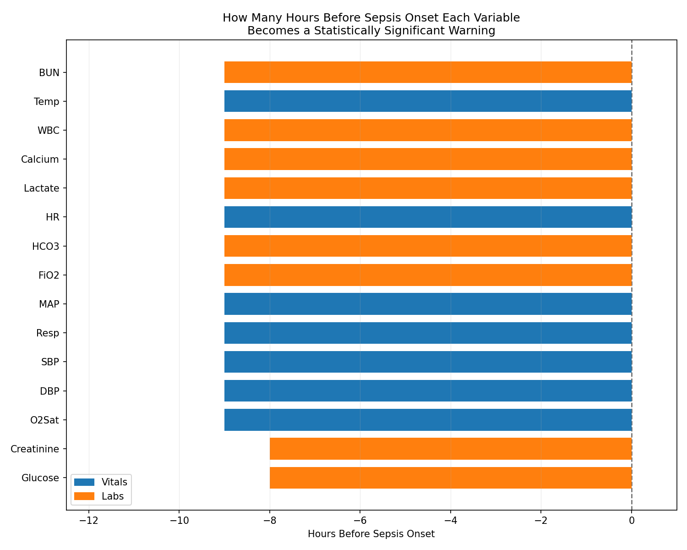
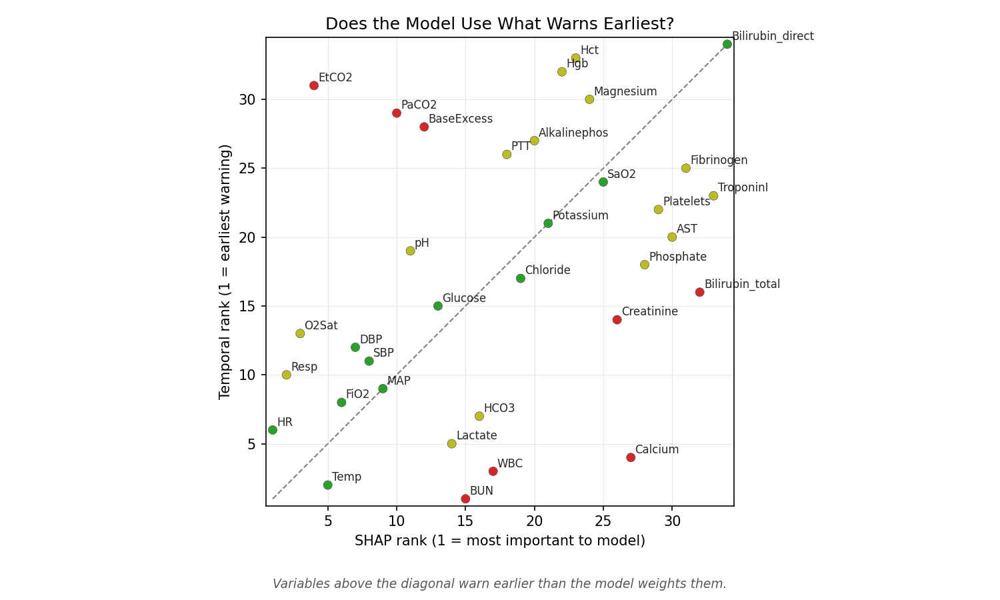

# Sepsis Early Warning Timeline


> Sepsis kills because it is caught too late.  
> I built this to ask: which clinical variables could have warned us earlier, and by how many hours?

---

## The Problem

I kept seeing papers that treat sepsis as a yes or no prediction. That is fine for benchmarking, but it skips the question I actually care about: which measurements drift apart *hours* before anyone labels sepsis, and does a model even use those measurements if they show up in the chart rarely?

I ran everything on the PhysioNet 2019 training data: **40,336 ICU patients** total.

---

## What I Found

BUN and creatinine light up early in the timeline (up to **9 hours** before onset in what the data allows). They also sit in a thin slice of ICU hours. I counted something like **7%** of hourly rows where those labs are present at all, which is a different problem from “is the lab useful.”

The XGBoost model I trained does something blunt: it leans on vitals because vitals exist almost every hour. BUN is **#1** on my temporal ranking and **#15** on SHAP. Creatinine is **#14** temporally and **#26** in SHAP. So the gap is not mysterious. The model learns from what it sees often.

If I had to state the uncomfortable part in one line: kidney markers carry an early signal, but they are sparse in the record, so the classifier barely learns from them. That is a documentation and ordering problem as much as a modeling problem.

---

## Methods (short)

I took **34** lab and vital columns (demographics and IDs stripped out). For each variable and each hour before onset, I ran a Mann-Whitney test with Bonferroni correction across the hourly windows. The earliest hour that survives correction is what I call that variable’s lead time.

For the model piece I snapshot patients at **6 hours** before onset, median-impute, fit **XGBoost** with class weighting, then **SHAP** to rank features. I line that rank up next to the temporal rank from the stats above.

---

## Results



*Top 15 variables by lead time. Bars read as “how far back from onset the signal first clears the corrected threshold.”*



*Below the diagonal: warns earlier than the model weights it. BUN and creatinine sit down there.*

| Metric | Value |
|--------|-------|
| Patients | 40,336 |
| Sepsis rate | 7.3% |
| Model AUC-ROC | 0.736 |
| Longest lead time in this table | 9 h (shared by several vars, BUN among them) |
| Largest effect size (CLES distance from 0.5) | Creatinine (~0.38) |
| BUN: temporal rank vs SHAP | #1 vs #15 |

---

## How to Reproduce

### 1. Clone and install

```bash
git clone https://github.com/youssof20/sepsis-warning-timeline.git
cd sepsis-warning-timeline
pip install -r requirements.txt
```

### 2. Download data

PhysioNet Challenge 2019 (free):

https://physionet.org/content/challenge-2019/1.0.0/

Folder layout:

```text
data/
├── training_setA/   (*.psv)
└── training_setB/   (*.psv)
```

### 3. Run the pipeline

```bash
python src/data_pipeline.py
python src/temporal_analysis.py
python src/model.py
python src/visualize.py
```

Order is: cohort CSVs, then hourly tests and timeline, then XGBoost and SHAP, then the five figures.

### 4. Launch the app

```bash
streamlit run app.py
```

---

## Project Structure

```text
sepsis-warning-timeline/
├── app.py
├── requirements.txt
├── README.md
├── LICENSE
├── .gitignore
├── src/
│   ├── data_pipeline.py
│   ├── temporal_analysis.py
│   ├── model.py
│   └── visualize.py
└── outputs/
    ├── figures/
    └── results/
```

---

## Why this might matter clinically

Vitals dominate most bedside scores. The stats here say renal markers move early when they are measured. They are not measured every hour. I am not arguing to drop vitals. I am saying frequency of labs changes what ends up in the chart, and therefore what any model trained on that chart can learn.

AUC alone will not show that. Pairing discrimination with lead time and missingness does.

---

## Limitations

I am comparing observational groups at matched ICU hours. I am not claiming causation.

Two hospital systems in the public training split. I would not assume this transfers everywhere.

Labs are ordered when someone is worried. Present values are already filtered by clinical judgment.

Most patients in this dataset do not have more than about **nine hours** of pre-onset ICU history in the window I exported. I cannot claim twelve-hour lead times from this table.

---

## Citation

**Youssof Sallam.** *Sepsis Early Warning Timeline* (2025).  
GitHub: <https://github.com/youssof20/sepsis-warning-timeline>

---

## Acknowledgements

Data from PhysioNet. Reyna et al., *Early Prediction of Sepsis from Clinical Data*, Computing in Cardiology 2019.
